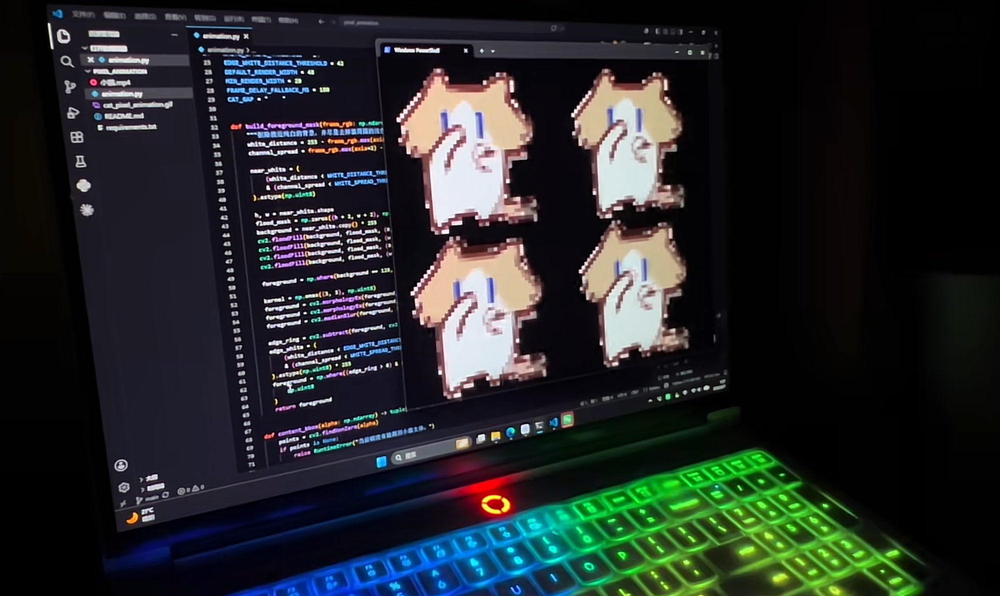

<div align="center">

# 🐱 Dancing Kitten

### 在终端里播放像素风小猫动画 🎮

*一只会跳舞的小猫，送给每一个热爱像素风的人。*

[]()
[]()
[]()
[]()

---

https://github.com/user-attachments/assets/c0f3e2b5-2a2e-4d7f-a7b9-1e9e7d03c82f

<br>

**✨ 点个 Star ⭐ 支持一下吧！你的支持是我更新的动力 ✨**

</div>

---

## 📖 目录

- [这是做什么的？](#-这是做什么的)
- [✨ 效果预览](#-效果预览)
- [🚀 新手快速入门](#-新手快速入门)
  - [第一步：安装 Python](#第一步安装-python)
  - [第二步：下载本项目](#第二步下载本项目)
  - [第三步：安装依赖](#第三步安装依赖)
  - [第四步：运行！](#第四步运行)
- [🎨 效果展示](#-效果展示)
- [📁 项目结构](#-项目结构)
- [⚙️ 自定义设置](#️-自定义设置)
- [🔧 常见问题](#-常见问题)
- [💡 实现原理](#-实现原理)
- [📜 开源许可](#-开源许可)

---

## 🤔 这是做什么的？

`Dancing Kitten` 是一个**在终端（命令行）里播放像素动画**的小项目。

你只需要打开终端，运行一条命令，就能看到四只像素小猫在你的终端里同步跳舞 🎉

> 💡 **什么是"终端/命令行"？**
> - Windows 上叫"命令提示符"或"PowerShell"或"Windows Terminal"
> - macOS 上叫"终端"（Terminal）
> - 说白了就是那个**黑底白字的窗口**

---

## ✨ 效果预览

| 运行效果 |
|:--------:|
|  |
| *四只像素小猫在终端里同步跳舞* |

> ⚡ 动画会自动适配你的终端窗口大小，全屏体验更佳！

---

## 🚀 新手快速入门

> ⏱️ 整个过程大约需要 **5 分钟**，跟着做就好！

### 第一步：安装 Python

> 🎯 **本项目的运行环境要求 Python 3.10 及以上版本**

<details>
<summary><b>🪟 Windows 用户点这里</b></summary>

1. 打开浏览器，访问 [Python 官网下载页](https://www.python.org/downloads/)
2. 点击大大的黄色 **Download Python** 按钮（推荐下载 3.10 ~ 3.12 版本）
3. 下载完成后，**双击**安装包
4. ⚠️ **最重要的一步！** 在安装界面**一定要勾选**底部的 ☑️ **Add Python to PATH**
   - 勾选后 → 点击 **Install Now**
5. 等待安装完成，点击 **Close**
6. 验证安装是否成功：
   - 按键盘 `Win + R`，输入 `cmd`，回车
   - 在弹出的黑窗口中输入：
   ```cmd
   python --version
   ```
   - 如果看到类似 `Python 3.12.x` 的输出，说明安装成功！✅

> ❓ 如果显示 `'python' 不是内部或外部命令`，说明没有勾选 PATH，建议重新安装并记得勾选。
</details>

<details>
<summary><b>🍎 macOS 用户点这里</b></summary>

1. 打开终端（在"启动台"→"其他"→"终端"，或 Command+Space 搜索"终端"）
2. 检查是否已安装 Python：
   ```bash
   python3 --version
   ```
3. 如果没安装，推荐用 Homebrew 安装：
   ```bash
   # 先安装 Homebrew（如果还没有的话）
   /bin/bash -c "$(curl -fsSL https://raw.githubusercontent.com/Homebrew/install/HEAD/install.sh)"
   
   # 安装 Python
   brew install python@3.12
   ```
4. 验证安装成功：
   ```bash
   python3 --version
   # 应输出: Python 3.12.x
   ```
</details>

<details>
<summary><b>🐧 Linux 用户点这里</b></summary>

```bash
# Ubuntu / Debian
sudo apt update
sudo apt install python3 python3-pip python3-venv -y

# 验证
python3 --version

# Fedora / RHEL
sudo dnf install python3 python3-pip
```
</details>

---

### 第二步：下载本项目

有两种方式：

<details open>
<summary><b>🅰️ 方式一：直接下载 ZIP（推荐新手）</b></summary>

1. 打开本项目的 GitHub 页面：https://github.com/KongDeShang/dancing-kitten
2. 点击绿色的 ⬇️ **Code** 按钮
3. 选择 **Download ZIP**
4. 解压到你喜欢的位置（比如桌面）
5. 进入解压后的文件夹 `dancing-kitten-main`
</details>

<details>
<summary><b>🅱️ 方式二：用 Git 克隆（推荐开发者）</b></summary>

```bash
# 需要先安装 Git（https://git-scm.com/downloads）
git clone https://github.com/KongDeShang/dancing-kitten.git
cd dancing-kitten
```
</details>

---

### 第三步：安装依赖

本项目需要安装几个 Python 库。打开你的终端，进入项目目录后运行：

```bash
# 💡 强烈建议先创建虚拟环境（可选但推荐）
# Windows:
python -m venv .venv
.venv\Scripts\activate

# macOS / Linux:
python3 -m venv .venv
source .venv/bin/activate

# 然后安装依赖
pip install -r pixel_animation/requirements.txt
```

> 📦 这行命令会自动安装以下库：
> - `opencv-python` — 图像处理
> - `numpy` — 矩阵运算
> - `Pillow` — GIF 读取

稍等一会儿，看到 `Successfully installed ...` 就说明安装成功了！✅

---

### 第四步：运行！

在终端中，确保你在项目目录下，然后执行：

```bash
# Windows:
python pixel_animation/animation.py

# macOS / Linux:
python3 pixel_animation/animation.py
```

**🎉 看到小猫了吗？** 如果没有，或者遇到了错误，请查看下面的[常见问题](#-常见问题)。

要退出动画，按 `Ctrl + C` 即可回到终端。

---

## 🎨 效果展示

| 配置 | 效果 |
|:----:|:----:|
| **默认 2×2 四猫** | 四只小猫同步跳舞，华丽又可爱 |
| **放大窗口** | 小猫自动变大，细节更丰富 |
| **缩小窗口** | 小猫自动缩到合适大小，不会超出屏幕 |
| **全屏模式** | 沉浸式像素猫体验！ |

---

## 📁 项目结构

```
dancing-kitten/
├── .gitignore                # Git 忽略规则
├── LICENSE                   # MIT 开源许可证
├── README.md                 # 👈 你现在看的这个文件
│
├── assets/                   # 🖼️ 资源文件
│   └── screenshot.png        #    运行效果截图
│
├── pixel_animation/          # 🎯 核心代码目录
│   ├── animation.py          #    主程序（所有魔法在这里）
│   ├── cat_pixel_animation.gif  #  动画源文件
│   ├── requirements.txt      #    Python 依赖列表
│   └── README.md             #    技术细节文档
```

---

## ⚙️ 自定义设置

想自己改效果？打开 `pixel_animation/animation.py`，在文件顶部附近可以找到这些常量：

| 常量名 | 默认值 | 作用 |
|--------|:------:|:----:|
| `DEFAULT_RENDER_WIDTH` | `48` | 🖼️ 每只猫的渲染宽度（越大越清晰） |
| `MIN_RENDER_WIDTH` | `20` | 📏 最小渲染宽度 |
| `CAT_GAP` | `"    "` | ↔️ 猫与猫之间的间距（空格数） |
| `WHITE_DISTANCE_THRESHOLD` | `24` | 🎯 背景抠图灵敏度（越小抠得越狠） |
| `FRAME_DELAY_FALLBACK_MS` | `100` | ⏱️ 帧间隔（越小动画越快） |

**举个例子**，如果你想让猫更大一点：

```python
# 修改前
DEFAULT_RENDER_WIDTH = 48

# 修改后（更大更清晰）
DEFAULT_RENDER_WIDTH = 72
```

让猫之间的距离更大：

```python
CAT_GAP = "        "   # 8个空格，间距加倍
```

---

## 🔧 常见问题

<details>
<summary><b>❌ 'python' 不是内部或外部命令 / python 命令找不到</b></summary>

**原因**：安装 Python 时没有勾选 "Add Python to PATH"。

**解决办法**：
1. 卸载 Python（在"设置"→"应用"中找到 Python 卸载）
2. 重新安装，**记得勾选** ☑️ **Add Python to PATH**
3. 或者安装后手动添加 PATH（比较麻烦，建议重装）
</details>

<details>
<summary><b>❌ pip 不是内部或外部命令</b></summary>

**解决办法**：试试用 `python -m pip` 代替 `pip`：

```bash
python -m pip install -r pixel_animation/requirements.txt
```
</details>

<details>
<summary><b>❌ ModuleNotFoundError: No module named 'cv2'</b></summary>

**原因**：依赖没有安装成功。

**解决办法**：
```bash
pip install opencv-python numpy pillow
```
如果还是不行，试试：
```bash
python -m pip install --upgrade pip
pip install opencv-python numpy pillow
```
</details>

<details>
<summary><b>❌ 画面颜色不对 / 没有颜色</b></summary>

**原因**：你的终端不支持 True Color（24-bit 真彩色）。

**解决办法**：
- **Windows**：推荐安装 [Windows Terminal](https://apps.microsoft.com/detail/9n0dx20hk701)（微软商店免费）
- **macOS**：推荐 [iTerm2](https://iterm2.com/)
- **Linux**：大多数现代终端都支持（GNOME Terminal、Konsole 等）

> 可以用这个命令测试你的终端是否支持 True Color：
> ```bash
> printf "\x1b[38;2;255;100;0mTRUECOLOR\x1b[0m\n"
> ```
> 如果能显示橙色文字，说明支持。
</details>

<details>
<summary><b>❌ 画面太大或太小</b></summary>

**解决办法**：
- 调整终端窗口大小，画面会自动缩放
- 或者修改 `DEFAULT_RENDER_WIDTH` 的值（参考上面的[自定义设置](#️-自定义设置)）
</details>

<details>
<summary><b>❌ 动画看起来有点闪烁</b></summary>

**原因**：这是终端逐帧刷新的正常现象，不是 bug。

**小技巧**：适当增大 `FRAME_DELAY_FALLBACK_MS`（比如设成 `150`）可以让动画更平滑。
</details>

---

## 💡 实现原理

想知道代码是怎么工作的？简单来说流程是这样的：

```
读取 GIF → 抠除背景 → 裁剪猫身 → 缩放 → 转 ANSI 彩色字符 → 拼成 2×2 → 循环播放
```

1. **读取 GIF** 🎞️ — 用 Pillow 库逐帧读取 `cat_pixel_animation.gif`
2. **抠除背景** ✂️ — 使用 flood fill（泛洪填充）算法识别白色背景并去除
3. **裁剪猫身** 📐 — 自动找到小猫主体的边界框，裁剪掉多余空白
4. **缩放** 🔍 — 根据终端窗口大小等比缩放，保持比例不变形
5. **转 ANSI** 🎨 — 将每个像素转换为 ANSI True Color 转义码（类似 `\033[38;2;R;G;Bm`）
6. **拼网格** 🧩 — 将单只猫复制成 2×2 网格，四只同步跳舞
7. **播放** ▶️ — 按原 GIF 的帧间隔时间循环播放

> 详细技术细节请看 [`pixel_animation/README.md`](pixel_animation/README.md)

---

## ⭐ 支持我

如果你喜欢这个项目：

- ⭐ **点个 Star** — 让更多人看到它
- 🐛 **提 Issue** — 发现了 bug 或有好的建议
- 🔀 **提交 PR** — 一起来完善它

**你的每一个 Star 都是我更新的动力！** 🚀

<div align="center">

---

**[⬆ 回到顶部](#-dancing-kitten)**

**Made with ❤️ and 🐱**

</div>
