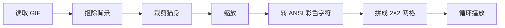

# 🐱 捂嘴小猫终端动画 — 技术文档

> 这是 [`dancing-kitten`](https://github.com/KongDeShang/dancing-kitten) 项目的核心模块技术说明。
> **新手用户请先看根目录的 [README.md](../README.md)，那里有完整的入门教程。**

## 功能概述

一个把 `cat_pixel_animation.gif` 渲染到终端里的小项目。运行后会在同一个终端窗口中显示 4 只对齐排布的小猫，保留像素风格，并对小猫周围的白底和浅色底板做抠图处理。

## 效果特点

- 读取原始 GIF 帧并循环播放动画
- 自动抠除外围白色背景和小猫周围的浅色方块
- 使用 ANSI True Color 在普通终端中渲染像素风画面
- 当前默认布局为 `2 x 2`，也就是一个终端里同时播放 4 只同步小猫
- 会根据终端窗口大小自动缩放，尽量保持原始比例不变形

## 项目结构

```text
pixel_animation/
├── animation.py                # 主程序
├── cat_pixel_animation.gif     # 动画源文件（1.4 MB）
├── requirements.txt            # Python 依赖列表
└── README.md                   # 本文件
```

## 实现思路

`animation.py` 的处理流程：



1. **读取 GIF** — 使用 Pillow 的 `ImageSequence.Iterator` 逐帧读取
2. **抠除背景** — 在 RGB 空间识别白色/近白区域，结合 flood fill 和形态学操作（开闭运算、中值滤波）生成前景遮罩
3. **裁剪** — 计算所有帧中小猫主体的联合边界框（union bbox），统一裁剪
4. **缩放** — 根据终端列数和行数等比缩放，使用 `INTER_NEAREST` 保持像素风格
5. **ANSI 渲染** — 将 RGBA 像素映射到终端半块字符（`▀`/`▄`），上下一对像素组合为一个字符，使用 True Color 转义序列
6. **网格** — 通过字符串拼接将单帧复制为 2×2 网格
7. **播放** — 按原始帧间隔时间循环播放，支持 `Ctrl+C` 退出

## 可调整常量

编辑 `animation.py` 顶部附近的常量：

| 常量 | 默认值 | 说明 |
|------|--------|------|
| `DEFAULT_RENDER_WIDTH` | 48 | 默认渲染宽度（像素） |
| `MIN_RENDER_WIDTH` | 20 | 最小渲染宽度 |
| `CAT_GAP` | `"    "` | 小猫之间的水平间距 |
| `WHITE_DISTANCE_THRESHOLD` | 24 | 白底识别阈值（越小抠得越严） |
| `WHITE_SPREAD_THRESHOLD` | 14 | 白色通道扩散阈值 |
| `EDGE_WHITE_DISTANCE_THRESHOLD` | 42 | 边缘白色识别阈值 |
| `FRAME_DELAY_FALLBACK_MS` | 100 | GIF 帧间隔回退值（毫秒） |

## 关键技术

- **flood fill** — 从四角扩散识别背景区域，避免内部白色点被误抠
- **形态学操作** — `MORPH_OPEN` + `MORPH_CLOSE` 去除噪点、填补空洞
- **中值滤波** — 平滑遮罩边缘
- **边缘处理** — 识别前景边缘的浅色像素并清除，去除白边残留
- **ANSI True Color** — `\033[38;2;R;G;Bm`（前景色）和 `\033[48;2;R;G;Bm`（背景色）
- **半块字符** — 利用 `▀` 字符上半部分显示一个像素、背景显示下方像素，实现 2× 垂直分辨率

## 常见问题

### 动画颜色不对或者没有颜色

说明当前终端可能不支持 True Color，建议换到支持 `24-bit color` 的终端里运行：

- **Windows**: [Windows Terminal](https://apps.microsoft.com/detail/9n0dx20hk701)
- **macOS**: [iTerm2](https://iterm2.com/)
- **Linux**: GNOME Terminal、Konsole、Alacritty 等

### 画面太大或太小

调整终端窗口大小，或者修改 `DEFAULT_RENDER_WIDTH`。

### 动画看起来闪烁

终端逐帧刷新本身会有一定闪烁感，属于文本终端动画的正常现象。可以尝试增大 `FRAME_DELAY_FALLBACK_MS`。
